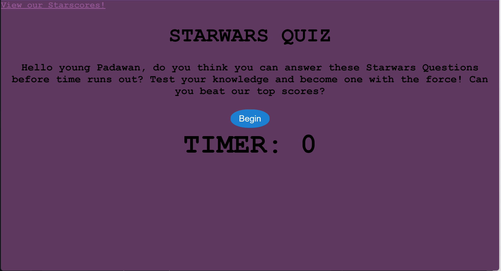
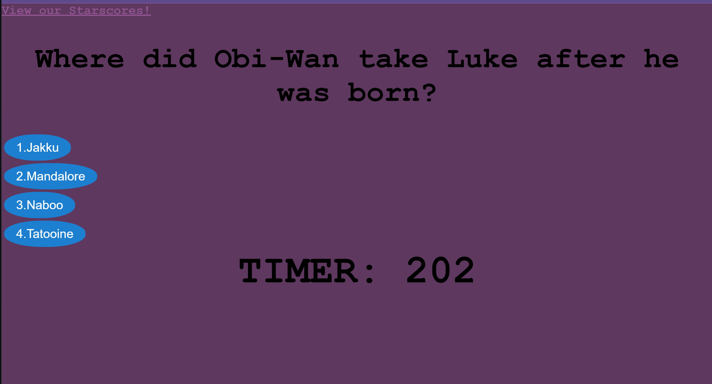
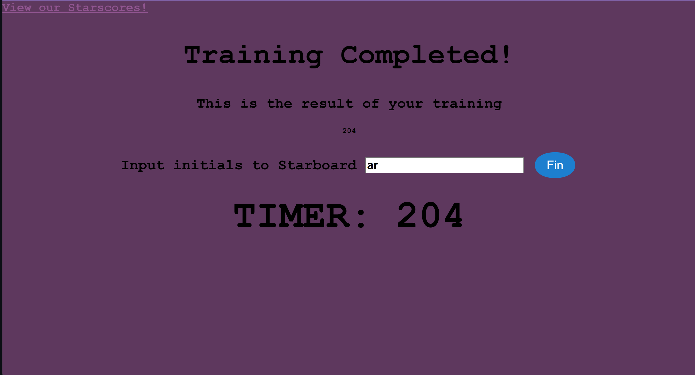
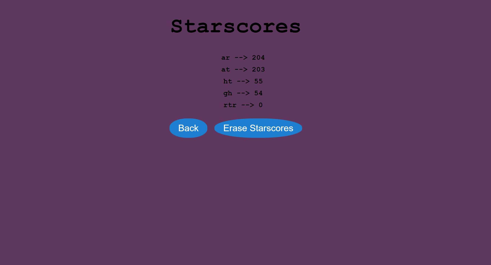

# starscore-quiz

For this assignment, I was instructed to create a functioning 'Code Quiz' that will allow the user to answer a few questions and the oportunity to save their quiz score. To construct this assignment, I used HTML, JavaScript, as well as CSS. The local storage feature will allow the user to save said score so they can view it as they please. The application will display a link in the homepage that will allow the user to see the highscore of other players as well. It features a timer that goes down by 50 seconds if the user gets a question wrong. Eventually, if the user answers enough questions wrong the timer will hit 0 and end the game. If the user is able to answer the questions correctly it will display them all and give them their score at the end of the game. 

The assignment also features working buttons for the questions, to begin the quiz, to enter their initials for their score, back button and an erase score button. I have named this assignment "Starscores.


## USER STORY

As the student
I WANT to create a quiz that allows my users to answer a series of questions and save their scores while being timed 
SO THAT when other users play they can try to beat the highest score 


## ACCEPTANCE CRITERIA 

```
GIVEN the user plays the Starwars Quiz
WHEN the user clicks begin 
THEN the game starts and displays the first question and timer starts counting down
WHEN a question is answered correctly
THEN the timer continues to count down and presents the next question 
WHEN a question is answered incorrectly 
THEN the timer subtracts by 50
WHEN the timer reaches 0 
THEN the game ends
WHEN the user finishes the game and answers the questions correct 
THEN the game ends and the user is presented with their score
WHEN the user finishes the game
THEN the user enters their initials and saves it to the Starscores board
WHEN initials are entered, the user is presented with other scores
THEN the user can either play the game again and try to beat their score or they have the option to delete all the scores presented in the Starscores board
```


## MOCK UP 

The following are images of the quiz 











## ACKNOWLEDGMENTS
Here are some resources used for this project

https://parade.com/1161189/alexandra-hurtado/star-wars-trivia/

https://developer.mozilla.org/en-US/docs/Learn/CSS/First_steps/Getting_started

https://developer.mozilla.org/en-US/docs/Learn/Getting_started_with_the_web/JavaScript_basics

https://developer.mozilla.org/en-US/docs/Learn/HTML/Introduction_to_HTML/HTML_text_fundamentals


## LINKS

file:///C:/Users/amand/Desktop/code%20quiz/index.html

https://amanda-er.github.io/starscore-quiz/